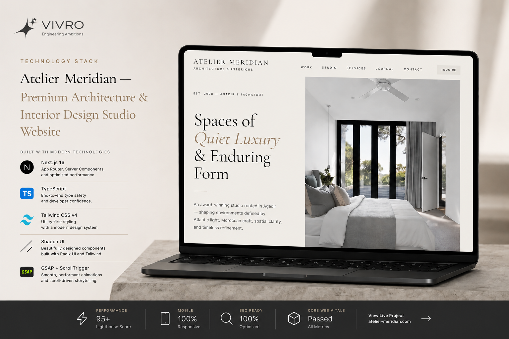

# Atelier Meridian



Premium architecture and interior design studio website for **Atelier Meridian** — an award-winning practice based in Agadir and Taghazout, Morocco. Built with Next.js, Tailwind CSS, Shadcn UI, and GSAP.

**Live demo:** https://premium-architecture-studio.vivro.dev/

**Developed by [vivro.dev](https://vivro.dev)**

---

## Features

- **Minimal luxury aesthetic** — warm ivory palette, bronze accents, Cormorant Garamond + Inter typography
- **Immersive home page** — GSAP hero entrance animations and horizontal ScrollTrigger project showcase
- **Full site architecture** — Work, Studio, Services, Journal, Team, Awards, Careers, Contact, Privacy
- **Scroll-driven motion** — `useGSAP` reveal animations across all inner pages
- **Mobile-optimized** — vertical project layout on small screens, reduced motion support, tuned image delivery
- **SEO-ready** — metadata, sitemap, robots.txt, JSON-LD, dynamic Open Graph images
- **Branded assets** — generated favicons, Apple touch icon, and OG images via `next/og`

---

## Tech Stack

| Layer | Technology |
| --- | --- |
| Framework | [Next.js 16](https://nextjs.org/) (App Router) |
| Language | TypeScript |
| Styling | [Tailwind CSS v4](https://tailwindcss.com/) |
| UI | [Shadcn UI](https://ui.shadcn.com/) (base-nova) |
| Animation | [GSAP](https://gsap.com/) + [@gsap/react](https://www.npmjs.com/package/@gsap/react) |
| Icons | [Lucide React](https://lucide.dev/) |
| Fonts | Cormorant Garamond, Inter (Google Fonts) |

---

## Getting Started

### Prerequisites

- Node.js 20+
- npm (or pnpm / yarn / bun)

### Installation

```bash
git clone https://github.com/Vivro-Dev-Agency/Premium-Architecture-Studio.git
cd Premium-Architecture-Studio
npm install
```

### Environment

Copy the example env file and set your site URL:

```bash
cp .env.example .env.local
```

```env
NEXT_PUBLIC_SITE_URL=http://localhost:3000
```

In production, use your canonical domain (e.g. `https://atelier-meridian.ma`).

### Development

```bash
npm run dev
```

Open [http://localhost:3000](http://localhost:3000).

### Production

```bash
npm run build
npm start
```

### Lint

```bash
npm run lint
```

---

## Project Structure

```
app/
├── (site)/              # Main site routes (shared layout)
│   ├── page.tsx         # Home
│   ├── work/
│   ├── studio/
│   ├── services/
│   ├── journal/
│   ├── team/
│   ├── awards/
│   ├── careers/
│   ├── contact/
│   └── privacy/
├── icon.tsx             # Favicon (32×32)
├── apple-icon.tsx       # Apple touch icon
├── opengraph-image.tsx  # Default OG image
├── twitter-image.tsx    # Twitter card image
├── og/route.tsx         # Dynamic per-page OG images
├── sitemap.ts
├── robots.ts
├── layout.tsx
└── globals.css

components/
├── home/                # Hero, Featured Projects
├── layout/              # Navbar, Footer, Page header, NavLink
├── motion/              # GSAP reveal utilities
├── contact/             # Contact form
├── seo/                 # JSON-LD schemas
└── ui/                  # Shadcn components

lib/
├── brand/               # OG image templates, colors, fonts
├── data/                # Projects, services, team, navigation
├── gsap/                # GSAP config & motion helpers
├── seo.ts               # Site config & metadata helpers
└── image.ts             # Image size/quality utilities

public/
└── site.webmanifest     # PWA manifest
```

---

## Pages

| Route | Description |
| --- | --- |
| `/` | Home — hero + featured projects horizontal scroll |
| `/work` | Full portfolio grid |
| `/studio` | About, philosophy, stats |
| `/services` | Services overview |
| `/services/[slug]` | Architecture, Interiors, Landscape, Consulting |
| `/journal` | Articles listing |
| `/journal/[slug]` | Individual article |
| `/team` | Team members |
| `/awards` | Awards timeline |
| `/careers` | Open positions |
| `/contact` | Inquiry form + office info |
| `/privacy` | Privacy policy |

---

## Deployment

Optimized for [Vercel](https://vercel.com/):

1. Push the repository to GitHub
2. Import the project in Vercel
3. Set `NEXT_PUBLIC_SITE_URL` to your production domain
4. Deploy

Other Node.js hosts that support Next.js 16 work as well.

---

## Customization

| What to change | Where |
| --- | --- |
| Site name, SEO, contact | `lib/seo.ts` |
| Offices & emails | `lib/data/site.ts` |
| Navigation links | `lib/data/navigation.ts` |
| Projects | `lib/data/projects.ts` |
| Services | `lib/data/services.ts` |
| Team, awards, journal | `lib/data/content.ts` |
| Brand colors (OG/favicons) | `lib/brand/colors.ts` |
| Global styles & scrollbar | `app/globals.css` |

---

## Credits

- **Client / Brand:** VIVRO
- **Development:** [vivro.dev](https://vivro.dev)
- **Images:** [Unsplash](https://unsplash.com/) (placeholder photography)

---

## License

Private project. All rights reserved unless otherwise specified by the repository owner.
